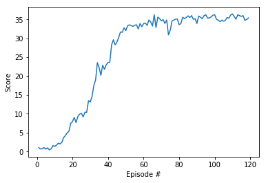

# Algorithm

Deep Deterministic Policy Gradient (DDPG) is a reinforcement learning algorithm that combines the Deep Q-Network (DQN) algorithm with the Deterministic Policy Gradient (DPG) algorithm to achieve continuous control in deterministic environments.

DDPG consists of three main components:
- Actor: The actor is a neural network that outputs the deterministic policy π(s). The policy is a function that maps states to actions. The actor is trained to maximize the expected future reward.
- Critic: The critic is a neural network that estimates the action-value function Q(s,a). The action-value function is a function that predicts the expected future reward for a given state and action. The critic is trained to minimize the Bellman error, which is the difference between the predicted future reward and the actual future reward.
- Replay Buffer: The replay buffer is a data structure that stores experiences, which are tuples of the form (s, a, r, s', done), where
s is the state
a is the action
r is the reward
s' is the next state
done is a flag that indicates whether the episode has ended
The replay buffer is used to provide the critic with a batch of experiences during training. This helps to stabilize the training process and improve the performance of the algorithm.

The training process for DDPG is as follows:
- Collect experiences: The agent interacts with the environment and collects experiences.
- Store experiences: The experiences are stored in the replay buffer.
- Sample experiences: A batch of experiences is sampled from the replay buffer.
- Update the critic: The critic is updated using the Bellman error.
- Update the actor: The actor is updated using the policy gradient theorem.
- Repeat steps 1-5 until convergence: The training process is repeated until the agent has learned a good policy.

Improments on DDPG:
- Experience replay: DDPG uses experience replay to improve the stability of the training process and reduce the correlation between samples. This is done by storing experiences in a replay buffer and sampling from the buffer during training.
- Target networks: DDPG uses target networks to stabilize the training process and reduce the risk of oscillations. This is done by having two copies of the critic network: a target network and an online network. The online network is used to estimate the action-value function, while the target network is used to update the policy parameters. The target network is updated less frequently than the online network, which helps to smooth out the updates and prevent the policy from becoming too unstable.
- Normalization: DDPG normalizes the state and reward inputs to the actor and critic networks. This helps to improve the stability of the training process and prevent the networks from becoming too sensitive to the scale of the inputs.
- Exploration: DDPG uses an exploration strategy to encourage the agent to try new actions and avoid getting stuck in local optima. This is done by adding noise to the actions output by the actor network. The amount of noise is gradually reduced as the agent learns, which allows it to exploit the actions that it knows are good.

In this experiments, we tested all the settings suggested in the Benchmark Implementation section. The results presented here are made from creating samples from 20 agents, reducing the amount of noise at sampling actions step without performing clipping the gradients and minimizing the number of updates in 1 episode.

Training result:

The environment was solved in 119 episodes with Average Score is 30.16

# Improvement 
We can improve the stability of the training process by normalizing input states or performing clipping gradients. At the same time, we can also assign weight to samples at sampling from the experience buffer to create a more meaningful sample, or perform noise reduction when the model is close to converging to achieve better results.

